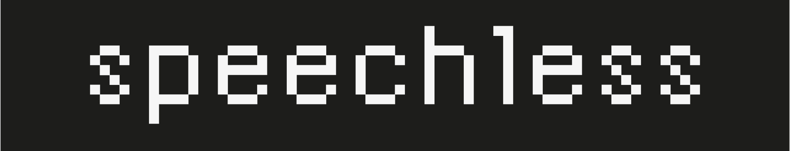
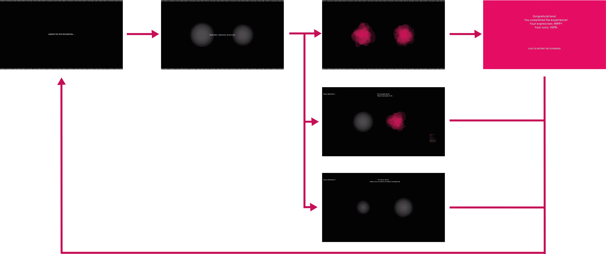

## 1. [PROJECT IDEA](#project-idea)

### a. Theme

### b. Aim / goal

### c. Concept

### d. Context of use

## 2. [STRUCTURE](#structure)

## 3. [CODE](#code)

### a. Face recognition

### b. Generative art

### c. Challenges

### d. References and tutorials

## 4. [TEAM](#4-team)


# PROJECT IDEA

**THEME**

The project is inspired by two of VISAP 2020 ‘s themes, enchantment and beyond borders.
Firstly borders, which can be both metaphorical and physical barriers between one another. In our case, the border that we decided to cross is the language barrier, that very often become an obstacle when it comes to understanding other people’s feeling; face expressions, however, never lie.  
Regarding the theme of enchantment, we decided to use it in a more practical way; through the use of generative art to represent the human feelings, we want our users to be astonished at the sight of the physical version of something as intangible as their emotions.

**AIM**

The goal of this project is to make people reflect on the power facial expressions holds in expressing feelings and emotions, through the use of an entertaining and playful experience. We want the users to create a synchrony, a harmony based on the emotion they’re expressing.

**CONCEPT**

The project is designed to be used by two users that are physically in the same room; the users are represented by two grey blobs that are wiggling around in the canvas. Through facial recognition, the blob will animate in different ways based on the current facial expression, changing shape, colors, pace. The two blobs will also be moving in the canvas: if the two people are expressing the same emotion, the shapes will pull closer, while if the emotions are different, they will pull further away from each other.

**CONTEXT OF USE**

Our project has been designed as an installation/exhibit; the installation is held in a closed room where the entrance is limited to two people at the same time who will position themselves in front of the two signs indicated on the screen, to make the facial recognition as accurate as possible. The reason why we chose to structure the project as an exhibition is because exhibitions are way more immersive than normal web apps, and they can give a sense of enchantment themselves, which helps to fulfil the purpose.

# STRUCTURE



The project is composed of a single HTML page, in which the various parts are set to go off based on timers and the interaction of two faces in front of the screen.

1. The introduction page invites the two users to place themselves in front of the two blobs
2. The presence of two faces activates the second part of the experience: a brief text will appear on screen explaining how the experience work, and right after the two coloured blobs will start animating and moving depending on the detected facial expressions.

   - **a.** if the two facial expressions match for a certain period of time, they will pull closer and overlap; statistics about the matching expressions and overall sync will be displayed on screen and the experience will come to an end
   - **b.** if for some reason the users abandon mid-experience, the absence of a face for more than a few seconds will stop the experience
   - **c.** if there are less than two people in front of the screen, a countdown will activate, informing the user that there are not enough faces
   - **d.** if there are more than two people an invitation will ask the users to reduce the number of faces in front of the screen

3. In case a,b and c, the page will go back to the introduction page, inviting other users to take their place in front of the screen.

# CODE

**FACE RECOGNITION**

[face-api.js ](justadudewhohacks.github.io) was implemented for face detection and face recognition. In our specific case, we used the facial expression recognition model. All the code containing the instruction to load the face-api library and detect the faces is cointained in the [script.js](./public/script.js) file.

The library is able to detect and differentiate between 7 different expressions: happiness, sadness, anger, disgust, surprise, fear and neutral.

**GENERATIVE ART**

The two blobs are created through the use of generative art based on the different emotions. To create them, we used a class called Organic, which contains the single layers that compose each blob

```JavaScript
class Organic {
  constructor(id, radius, pos, roughness, angle, color) {
  this.id = id;
  this.radius = radius; //radius of blob
  this.pos = pos;
  this.roughness = roughness; //magnitude of distortion
  this.angle = angle; //angle of rotation
  this.color = color; //color of the blob
  this.xSpeed = 1;
  this.ySpeed = 1;
}
```

and then we overlapped various layers in a Blob class to create the effective blob.

```JavaScript
class Blob {
  constructor(id, x, y) {
    this.id = id;
    this.pos = createVector(x, y);
    this.startPosition = createVector(x, y);
    this.grown = false;
    this.vel = createVector();
    this.acc = createVector();
    this.organics = [];
    this.n_blobs = 10;
    this.createOrganics();
    this.change = 0;

    this.intensity = 0;
    this.expressions = { prev: "neutral", next: "neutral" };
    this.properties = {
      color: color(89, 84, 87),
      changeIncrement: 0,
      offset: 0,
    };

    this.prevProp = {};
    this.nextProp = {};

    this.expressionList = {};

    this.neutral = false;
    this.change = 0;
    this.transition = false;
  }

  createOrganics() {
    for (let i = 0; i < this.n_blobs; i++) {
      this.organics.push(
        new Organic(
          i,
          10,
          this.pos,
          i * 10,
          i * random(90),
          expressions_properties.neutral.color
        )
      );
    }
  }
```

The movement of each blob is influenced by two points: one in the middle of the screen and one on the side of the screen where the blob stands; the blob on the right will be attracted by the middle and the right point, while the one on the left will be attracted to the middle and the left point.

```JavaScript
  attracted(target, intensity) {
    let force = p5.Vector.sub(target, this.pos);
    let d = force.mag();
    d = constrain(d, 1, 100);
    const G = 50;
    const speed = 40;
    const strength = G / d;

    if ((d < 5 && intensity > 0.5) || detections.length < 2) this.vel.set(0, 0);
    else {
      if (intensity == 0) intensity = 0.1;
      const mag = (strength * intensity * speed) / d;
      force.setMag(mag);
      this.acc.add(force);
    }
  }
```

When the two expressions are in sync, the objects will be attracted by the point in the middle and repulsed by the respective external points, whereas different expressions will pull the two blobs towards the respective external points and push them away from the middle one.

```JavaScript
if (screen_2) {
  // Intensity of central point (-2, 2) --> 0-100%
  let mappedI = map(sync.curr, 0, 100, -2, 2);
  // Intensity of side point (-1, 1) --> 100-0%
  let mappedI_2 = map(sync.curr, 0, 100, 1, -1);
  b.attracted(a0, mappedI);
  b.pos.x < width / 2
    ? b.attracted(a1, mappedI_2)
    : b.attracted(a2, mappedI_2);
  b.update(); // Update blobs' postition
      }
```

**CHALLENGES**

We tried to use face-api implementing [ML5](https://ml5js.org/), an open source library which simplifies the use of machine learning libraries; however ML5 does not support face-api, so we had to directly download and install it.
The main challenges we faced came from the implementation of the face-api library and, consequently, assigning each expression to a specific variable. The library is set to recognize 7 different emotions; unfortunately, especially when the code is set to analyse more than one face, it has some difficulties to differenciate between fear, disgust and anger.

Each expression is characterized by a color (chosen after a study on the topic of color emotion), a rotation and a type of movement, for example:

```JavaScript
happy: {
      color: color(230, 13, 100),
      changeIncrement: 0.03,
      offset: 0.1,
    }
```

For every detection we obtain the strongest expression and we assign it to the blob.

```JavaScript
function getFaceElements() {
  detections.forEach((d, index) => {
    if (screen_1)
      blobs[index].pos.x =
        d.detection._box._x > 200 ? startPositions[0] : startPositions[1];

    blobs[index].expressionList = d.expressions;

    let expValue = 0;
    let c_exp = "";
    let i = 0;

    for (const e in d.expressions) {
      const value = e === "neutral" ? d.expressions[e] * 0.1 : d.expressions[e];
      if (value > expValue) {
        c_exp = e;
        expValue = value;
      }

      //  Display expressions values
      if (screen_2) {
        drawExpressionValues(e, d.expressions, index, i);
        i++;
      }
    }

    blobs[index].expressions.prev = blobs[index].expressions.next;
    blobs[index].expressions.next = c_exp;
    const prev = blobs[index].expressions.prev;
    const next = blobs[index].expressions.next;

    blobs[index].intensity = d.expressions[c_exp];
```

A challenging part was to make the Blobs continuously transition between the expressions' properties. Since the detections happen every 1000ms the transition must happen in that interval.

```JavaScript
    // Fluid transition between states
    if (prev != next) {
      console.log("%cTRANSITION!", "font-weight:bold; color:red");
      console.log(`${prev} --> ${next}`);
      blobs[index].transition = true;
      timeStamp = Date.now();
      blobs[index].prevProp = expressions_properties[prev];
      blobs[index].nextProp = expressions_properties[next];
    }

    if (blobs[index].transition) {
      blobs[index].propertiesTransitions(timeStamp);
    } else if (!blobs[index].transition) {
      blobs[index].properties.color = expressions_properties[next].color;
    }

});
```

```JavaScript
  // In Blob.js
  propertiesTransitions(lastTimestamp) {
    const now = Date.now();
    const interval = 1000;
    const amt = (now - lastTimestamp) / interval;

    const c1 = this.prevProp.color;
    const c2 = this.nextProp.color;

    this.properties.color = lerpColor(c1, c2, amt);
    this.properties.changeIncrement = lerp(
      this.prevProp.changeIncrement,
      this.nextProp.changeIncrement,
      amt
    );
    this.properties.offset = lerp(
      this.prevProp.offset,
      this.nextProp.offset,
      amt
    );
    this.properties.color.setAlpha(alpha);

    if (amt >= 1) this.transition = false;
  }
```

The same method is used to transition between every sync percentage and to make the background fade to black at the end.

To obtain the synchronization value we made an operation of Shallow Equality between the two objects.

```JavaScript
if (detections.length == 2) {
sync.prev = sync.next;
sync.next = shallowEquity(blobs[0].expressionList, blobs[1].expressionList);
```

```JavaScript
function shallowEquity(obj1, obj2) {
  const keys = Object.keys(obj1);
  let diff = 0;
  for (let key of keys) {
    if (key != "neutral") {
      const delta = abs(obj1[key] - obj2[key]);
      diff += delta;
    }
  }
  // Create object with % of every expression
  let perc = map(diff, 0, 2, 100, 0);
  return round(perc, 1);
}
```

Another challenging aspect was how to handle the presence of zero, one, two or more people in front of the screen and how to make the blobs react. In the end, we came up with this solution, in the manageBlobs() function:

- if there is no one in front of the screen, the blobs will be neutral

```JavaScript
for (let i = 0; i < blobs.length; i++) {
    blobs[i].neutral = true;
    blobs[i].change += expressions_properties.neutralchangeIncrement;
    blobs[i].showBlobs();
  }
```

- if there is one person in front of the screen, the blob corresponding to the person will activate on the side where the person is located

```JavaScript
if (detections.length == 1 && !expansion) {
  blobs[1].pos.x =
    blobs[0].pos.x < width / 2 ? startPositions[1] : startPositions[0];
  blobs[1].neutral = true;
}
```

- if there are two people in front of the screen, the animation of each blob will depend on the person standing in front of it and will correspond to the phisical side where the face is located

```JavaScript
function getFaceElements() {
 detections.forEach((d, index) => {
    if (screen_1)
      blobs[index].pos.x =
        d.detection._box._x > 200 ? startPositions[0] : startPositions[1];
```

Lastly, we tried to implement a background sound to accompany the whole experience; however, we experienced some troubles as the sound library conflicts with the function createVector that we used in [Blob.js](./public/blob.js), so we decided to abandon the idea.

**REFERENCES AND TUTORIALS**

[Build Real Time Face Detection With JavaScript](https://www.youtube.com/watch?v=CVClHLwv-4I&t=183s&ab_channel=WebDevSimplified)

[Daniel Shiffman - The coding train](https://thecodingtrain.com/)

[Coding Challenge #56: Attraction and Repulsion Forces](https://www.youtube.com/watch?v=OAcXnzRNiCY)

# TEAM

[Valentina Bettoni](https://www.behance.net/valentibettoni)

[Alessio Brioschi](https://www.behance.net/alessiobrioschi1)

[Mara Castiglioni](https://www.behance.net/maracastiglioni)

[Sara Gussoni](https://www.behance.net/saragussoni/projects)

[Romario Muca](https://www.behance.net/romario2/projects)

```

```
